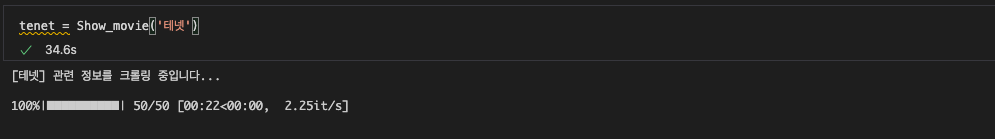
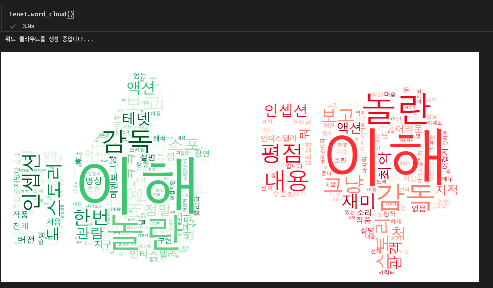

### 기말고사 프로젝트, 영화 평점 & 리뷰 키워드 분석
# Show Me the Movie

## 코드 개요
- class Movie  
기본적인 정보 크롤링 함수  
    - now(): static method로 코드 실행 날짜 기준 상영 영화 목록을 보여줌   
    - get_codentitle(): 원하는 영화 검색, 처음 추천되는 영화의 제목과 영화 코드를 가져옴
    - get_reviews(): get_codentitle()로 얻은 영화 코드를 활용하여 리뷰와 평점 크롤링
    - get_info(): 영화 기타 정보 크롤링

- class Show_movie  
시각화 관련 함수들
    - review(): 크롤링한 리뷰의 평점 분포를 보여줌
    - pos_neg(): Okt 형태소 분석기를 활용, 유의미한 용어 추출
    - word_cloud(): pos_neg()로 전처리한 단어를 이용하여 워드 클라우드 생성
    - movie_info(): 포스터와 함께 영화 기본 정보 출력

## 서론
이번 진행하게 된 프로젝트는 ‘네이버 영화 평점과 리뷰 분석’입니다. 최근 재미있는 영화들이 많이 개봉하고 있고, 사람들의 평 또한 각양각색이라 어떤 영화를 선택해서 보아야 할지 고민이 되어 이를 한 눈에 볼 수 있도록 하는 프로그램을 만들면 좋겠다고 생각하여 진행하게 되었습니다. 이를 위해 네이버 영화에 있는 각 영화의 네티즌 리뷰와 그에 대한 평점을 500개 정도 크롤링하고, 평점 분포를 보여주기 위해서는 bar plot을, 긍정/부정 리뷰에 자주 쓰인 용어를 보여주기 위해서는 마스크를 사용한 워드클라우드를 만들어보았습니다.

## 코드 설명

먼저 필요한 모듈을 import 해주고, main함수를 하나의 프로그램처럼 while문을 통해 돌릴 것이기 때문에 main함수가 실행되는 시간 측정을 위해 데코레이터로 사용할 checkTime함수를 정의했습니다.
  

### Movie class
주로 영화 정보를 크롤링하는 함수들이 들어가 있습니다. 기본적으로 필요한 base_url과 네이버에서 분류하는 영화 코드, 영화 제목, 포스터 이미지 링크, 장르, 감독, 배우, 그리고 movie_review 데이터 프레임을 init에 정의해 두었고, 밑에 함수들이 실행되면 update되도록 작성하였습니다.
#### now()
정적 메서드로 해서, 따로 객체를 생성하지 않고도 볼 수 있도록 하였습니다. 현재 상영 영화 예매순으로 상위10개만 수집하였습니다. 이 부분은 정적 페이지를 크롤링하는 부분이기 때문에 BeautifulSoup을 사용하여 제목과 장르, 감독을 크롤링할 수 있도록 하였고, 간혹 크롤링 중 오류가 발생할 수 있기 때문에 예외처리를 만들어놓았습니다. 중간에 멈추면 어디까지 크롤링되었는지 볼 수 있도록 finally에서 마지막까지 데이터 프레임이 row를 추가할 수 있도록 하였습니다.

#### get_codentitle()
네이버 영화에서 입력 받은 제목을 검색하여 가장 먼저 추천되는 영화의 코드와 제목을 받아오는 함수입니다. 동적으로 크롤링해야하기 때문에 Chromedriver를 사용하였습니다. 

#### get_reviews()
해당 영화 페이지 밑에 있는 네티즌 평점과 리뷰를 크롤링하는 함수입니다. 본 페이지에 존재하는 하위 frame으로 들어가기 때문에 switch를 해주고 크롤링을 시작해야 합니다. 모든 리뷰를 크롤링하기 어렵기 때문에 50페이지까지, 페이지당 10개씩 크롤링하여 데이터 프레임에 저장해줍니다. 이때 리뷰는 빈 문자열이 나올 수 있는데 이는 스포일러로 분류되어 숨겨져 있거나, 정말 빈 문자열이거나 두 경우입니다. 스포일러로 분류되었을 경우, 다른 element를 선택해야하지만 스포일러가 아닐 경우 이 부분은 element not found 에러가 발생되기 때문에 예외처리로 작성하였습니다. 만약 네티즌 리뷰가 50페이지까지 존재하지 않는다면 ‘pagerTagAnchor’를 클릭할 때 오류가 발생할 것이기 때문에 이 부분도 예외처리를 해주고, 빠져나올 때 혹시 모를 상황을 위해 한 번 더 저장해줍니다.

 
#### get_info()
영화의 기초 정보인 감독, 배우, 장르, 포스터를 크롤링하는 함수입니다. 정적 크롤링이기 때문에 여기도 BeautifulSoup만 사용하였고, 각 요소에서 포스터 이미지 주소와 장르를 저장해주었습니다. 감독과 배우는 하나의 큰 태그에 들어가 있지만, 배우는 배우 이름 옆에 (배역)이 붙어있기 때문에 이를 기준으로 배우와 감독을 구분하여 저장해주었습니다. 또한 제가 원했던 것은 하나의 문자열이기 때문에 ,로 연결해주었습니다.
  

### Show_movie class
크롤링한 데이터를 시각화하는 함수들을 담고 있습니다. 그러기 위해서는 먼저 Movie class에서 크롤링이 진행되어야 하기 때문에, 먼저 Movie의 기본 변수들을 받아오고, get_reviews()와 get_info()를 실행하여 초기화된 변수들을 업데이트 해줍니다. 

#### review()
크롤링한 리뷰들의 평점 분포를 bar plot으로 시각화하는 함수입니다. 업데이트된 self.movie_review의 star가 어떻게 분포되었는지를 먼저 데이터 프레임으로 만들어 줍니다. 이 때, 500개 밖에 크롤링하지 않았기 때문에 1~10까지의 평점 중 비어있는 평점이 있을 수 있기 때문에 균일성을 위해 1~10까지 있는 데이터 프레임과 합쳐줍니다. 또한 가장 안 좋은 1점은 빨간색으로, 가장 좋은 10점은 초록색으로 보일 수 있도록 seaborn의 팔레트를 설정해주었습니다.

#### pos_neg()
워드 클라우드를 만들기 위한 전처리 함수입니다. 별점이 8, 9, 10인 리뷰는 긍정 리뷰로, 별점이 1, 2, 3인 리뷰는 부정 리뷰로 분류하여 전처리하였습니다. KoNLPy에 있는 트위터 형태소 분석기인 Okt를 사용하여 형태소 분석을 진행, 그 중 긍정/부정의 의미가 담겨 있을만한 명사와 형용사, ‘ㅋㅋㅋㅋㅋ’와 같은 한국어 기호(?)만 선택하여 리뷰 단어에 포함하였습니다. 또한, ‘이 영화 별로’, ‘이 영화 재밌음’ 등 ‘영화’라는 단어를 사용하는 경우가 많은데 이는 긍/부정 의미가 담겨있다고 보기 어렵기 때문에 제외하였습니다. 

#### word_cloud()
본격적으로 워드 클라우드를 만들어 보겠습니다. 먼저 저는 좋아요 이미지와 싫어요 이미지를 워드 클라우드의 기본 마스크로 사용할 것이기 때문에, Image 모듈을 사용해서 마스킹을 해주었습니다. 앞에서 전처리한 pos_review와 neg_review를 빈도값 산출해주는 Counter에 넣고, 최빈도 세 자리수 갯수만큼 뽑아줍니다. 전체가 900개 이상이면 10으로 나눠주고, 이미 세 자리수라면 그대로 다 사용하도록 합니다. 마스크한 이미지를 활용하여, 긍정적인 리뷰는 좋아요 + 초록색, 부정적인 리뷰는 싫어요 + 빨간색 으로 이루어진 워드 클라우드를 생성하는데, 이때 review리스트가 비어있을 경우 오류가 발생하기 때문에 예외처리를 해주어 ‘긍정 리뷰 없음’ 혹은 ‘부정 리뷰 없음’의 이미지를 보여줄 수 있도록 하였습니다. 

#### movie_info()
수집했던 영화의 기본 정보를 포스터와 함께 보여주는 함수입니다. plt.imshow로 포스터를 보여주고, 그 밑에 제목, 장르, 감독, 출연진 배우와 크롤링한 500개 리뷰의 평균 평점을 출력해주었습니다.

## 객체 실행 결과
‘테넷’이라는 영화를 사용하여 실행해본 결과는 다음과 같습니다.  
  
  
  
   

  
## main함수 실행 결과
위의 결과를 하나의 프로그램처럼 처리할 수 있는 메인 함수를 작성했습니다. 
현재 상영작을 보거나, 영화를 검색하여 원하는 정보를 시각화할 수 있도록 작성하였습니다. 한 가지 영화에 대한 정보들을 나열하는 것이기 때문에 생성되는 객체는 하나입니다. 이 메인 함수가 실행되는 시간을 chekTime 데코레이터로 측정하였습니다.

‘월터의 상상은 현실이 된다’라는 영화제목 전체가 아닌 일부분을 입력해도, 네이버 영화 검색의 첫 번째 영화로 선택되기 때문에 원하는 영화가 제대로 크롤링된 것을 확인할 수 있습니다. 

    
    

